---
html:
    toc: true
    # number_sections: true # 标题开头加上编号
    toc_depth: 6
    toc_float:
        collapsed: false # 控制文档第一次打开时目录是否被折叠
        smooth_scroll: true # 控制页面滚动时，标题是否会随之变化
---

[toc]

<div align="center" style="color: #666; font-size: 0.9em; border-top: 1px solid #eee; padding-top: 10px;">
  <p>作者：<strong>Guo</strong></p>
  <p>Github：<a href="https://github.com/Sherry520">@Guo</a></p>
  <a href="mailto:22561797+Sherry520@users.noreply.github.com" style="color: #0078d4; text-decoration: none;">22561797+Sherry520@users.noreply.github.com</a>
  <p>最后更新：<time>2024-04-08</time></p>
</div>
___

## 前言提示

<font color="red">

<b>注:</b>
1：本文件提及的账号密码由管理员提供，自行安全妥善保存。
2：禁止在服务器直接使用 `rm` 相关命令。在自己名字的目录中，建立 `trash` 文件夹作为回收站，不需要的文件（夹）通过 `mv` 移动到 `trash` 文件夹中；确认无误再删除 `trash` 中的内容。
3：合理规划服务器目录结构，建议以 project 的形式进行总体规划。（参考文献 https://doi.org/10.1371/journal.pcbi.1000424 ）
4：毕业前夕，整理服务器及个人电脑文件，添加必要的 **readme** 说明，与导师讨论后，删除不必要的文件，如大量而且占空间的中间结果文件。

</font>

## A. 自学 Linux 操作系统

**适用范围：**

适用于数量遗传学、生物信息学、大数据等研究方向。从事其他研究方向人员，Linux 有助于解决 Windows 中难以实现的问题。

后文内容建立于你已经熟练掌握 Linux 操作系统，所以先学习如何使用。

<p>
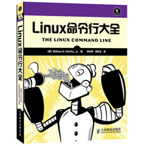</p>

**推荐书籍：** 自行学习 Linux 操作系统的使用，推荐书籍【Linux 命令行大全】，本实验室服务器系统采用 CentOS 7，基础操作与 Ubuntu 一致。

**安装使用：** 可在自己电脑安装 WSL 子系统进行学习（参考百度经验，win10 系统如何开启子系统；或通过其它手段建立 Linux 虚拟机）；MacOS 的“终端”应用可以运行 Linux 大部分基础操作。

**学习建议：**

- 了解 1、8、9、10、14、16、17、20、21 章
- 掌握 2~7、11、12、15.1、18、19、20.2、23、24 章
- 选看 13、22、23、25~36 章

<font color="red">

凡涉及管理员权限 sudo 的操作，在服务器一律不能实现。

</font>

## B. 自学R语言

**适用范围：** 

适用于统计分析（包括不限于分子实验中涉及的统计分析）、数量遗传学、生物信息学、大数据分析等研究方向；

<p>
</p>

**参考书籍：** 【R 语言编程艺术】

**学习建议：**

- 了解 1、8、12、14 章
- 掌握 2\~7、10\~11 章
- 选看 9、13、15、16 章

具有其他编程语言基础的，注意区分R与其他语言的不同（如索引）。

如欲进一步提高编程技能，建议学习一门其他编程语言，如 C、C++（考个计算机二级）。

## 1.VNP连接

服务器处于校园网内，从校内网访问不需要 VPN，从校外网访问需要借助 VPN。如果你当前处于校园网环境，可跳过 1.VPN 连接章节。

1）登录学校主页，可看见有校外 VPN 选项，点击进入校外 VPN 界面

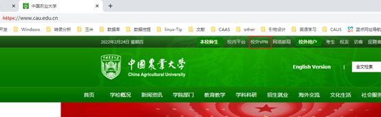

2）利用客户端可以实现 PC 整体访问校内网

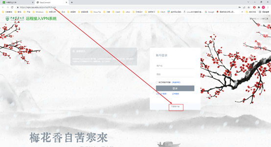

3）选择对应的平台下载，安装

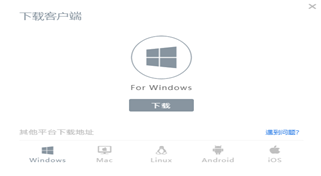

4）打开桌面 easy connect 图标


5）输入校园网 vpn 连接地址 https://vpn.cau.edu.cn/ ，地址可在 2）中地址栏获取，只保留域名地址

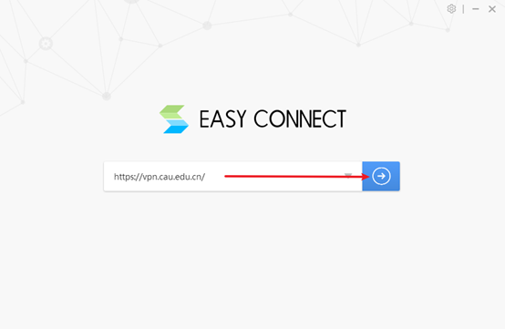

6）输入管理员提供的 VPN 连接账号和密码

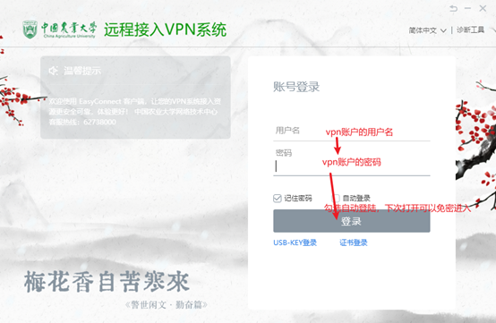

7）登录之后，使程序在后台即可。至此完成校外 VPN 登录

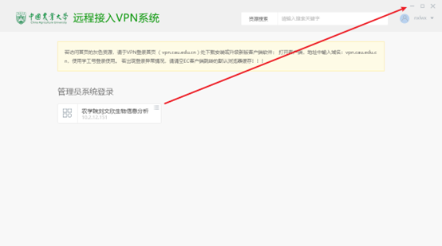

## 2.SSH 登录服务器

1）下载 xshell 和 xftp 软件。Xshell 用于 ssh 登录，xftp 用于传输文件。
下载地址 https://www.xshell.com/zh/free-for-home-school/ ，填写相应信息即可在邮箱收到下载链接

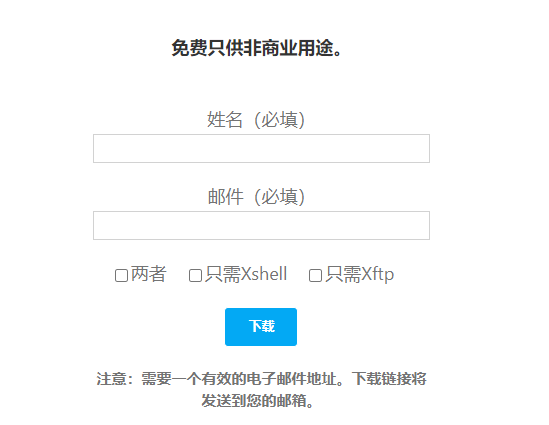

2）打开桌面 Xshell


3）打开之后会默认会话界面，点击新建；如未显示，可以自行打开

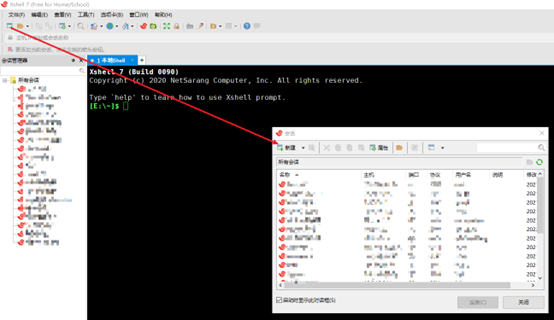

4）当前左侧连接为灰色状态，即代表当前处于连接选项界面。输入对应信息

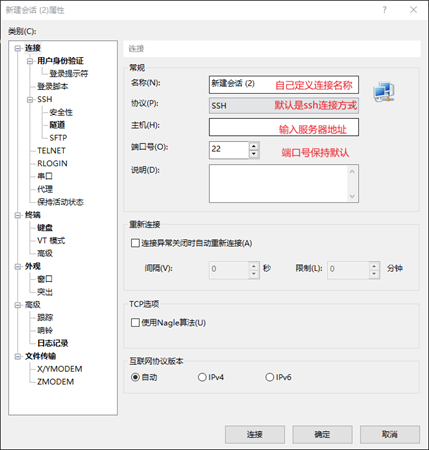

5）点击左侧用户身份登录，输入用户名和密码。点击连接可直接登录，确定为保存

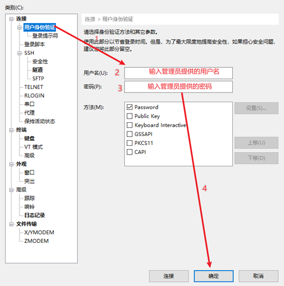

6）选择对应的连接，点击连接，进入服务器

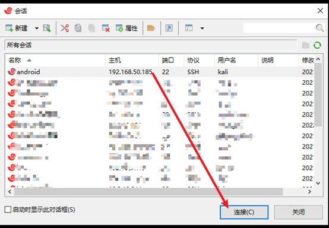

7）显示类似界面，即表示登录成功；否则请检查账户信息、是否在校内网或者 VPN 连接是否正确

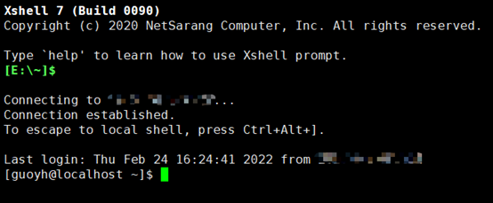

8）下次登录，可直接双击左侧对应的会话

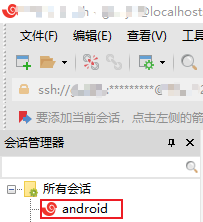

9）xftp 可在 xshell 登陆之后直接点击对应图标，免去登录过程；也可参考以上内容，单独设置 ftp 连接。


## 3.权限说明

1）凡是同一组的用户，可以相互访问，进行读(r)和执行(x)操作，不可以新建、修改、删除等写操作(w)

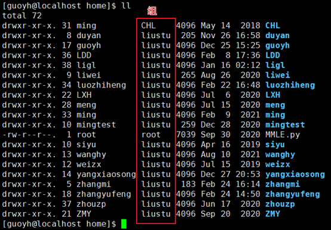

2）默认家目录在 *home* 目录里，此目录空间较少。大文件可以到`/liulab`下的自己的目录中

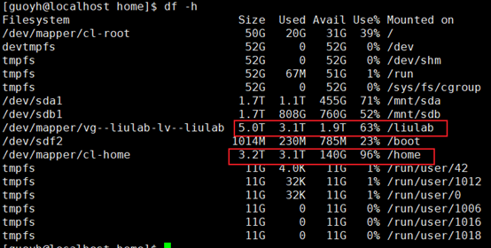

3）所有普通用户（非管理员）没有 `sudo` 权限，不能通过 `apt-get install` 安装软件，请自行通过离线方式安装

## 4.服务器联网

在线安装 `R` 包需要联网。服务器默认是没有联网的，需要通过命令，借助校园网的网关联网。

1）服务器联网命令如下：

网关账户换成自己的网关账号，密码也换成对应的自己的密码。后边地址一般不会变动，如有变动，参考校园网有线网的网关地址（有线/无线依据服务器联网方式）

```bash
curl -d "DDDDD=网关账户" -d "upass=密码" -d "0MKKey=" http://10.3.38.8/a70.htm
```

2）登陆之后，可以通过 `ping baidu.com` 测试是否联网成功
如下所示，代表联网成功。ctrl+C 键（不按+号）中断测试

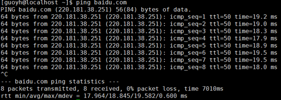

2）未避免流量损失，不需要联网时，到自己的网关管理界面强制下线服务器。根据服务器 IP 可以判断哪个是服务器


3）记不住登陆命令，可以采用 *python* 脚本登录，参见 Github 的介绍：https://github.com/Sherry520/LoginCAU

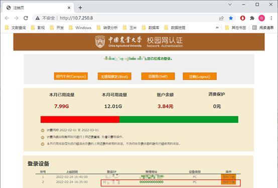

## 5.无人值守运行任务操作

服务器运行任务时，需要保持会话界面，关闭会话会使任务中断。即使单独通过 `nohup` 或者其它操作使任务程序在后台，关闭会话界面，依然会使任务中断。在网络不稳定，并且任务运行时间比较长的时候，网络中断会对工作造成严重影响。

通过 `screen` 可以创建会话，使程序真正的保持在后台运行。

1）创建一个新的窗口

输入以下命令，即创建了一个名为 mapping 的窗口

```bash
screen -S mapping
```

2）以 `nohup [command] &` 或者其他形式投递任务到后台运行

3）会话分离

如果我们想暂时退出做点别的事情，比如出去散散步或者下班。同时按住 `Ctrl+A+D` 键（不按+号），就可以暂时中断会话，而任务程序依然会在服务器上保持运行。之后就可以放心关闭终端去做其它事。

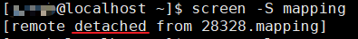

4）会话恢复

一段时间之后回来了，找到该 screen 会话：

```bash
screen -ls
```

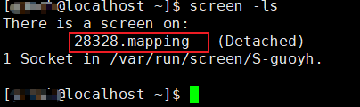

重新连接会话：后边数字按实际显示的替换

```bash
screen -r 28328
```

5）更多详细操作，请查阅 screen 相关资料

## 6.Module 环境变量管理工具

在 Linux 中，当同一款编译器、运行库、软件存在多个版本且多个版本都需要在不同的场景或人员使用时，配置这些内容的环境变量是一个非常繁琐的过程，而 `Moudle` 工具则提供了一个简单快速的方法，Moudle 全称为 *module-environment*，是一个专门管理环境变量的工具。

服务器已安装 Module 工具，具体使用方法自行查阅相关资料，编写适用于自己的 `modulefile`。（注意：不同版本的软件，只能通过编译方式自行安装）

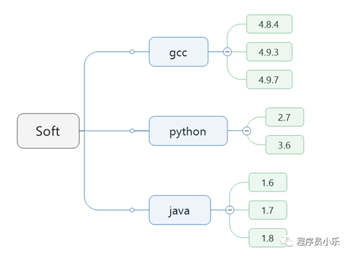

## 7.Spack 包管理器
`Spack` 是一个高性能包管理工具，支持软件不同版本，不同编译其及编译选项对安装包进行安装。详细使用参考[Spack 官方文档](https://spack.readthedocs.io/en/latest/)或者参见[csdn 相关教程](https://blog.csdn.net/Sherry102/article/details/139075791?spm=1001.2014.3001.5502)。

## 8.JDK（Java 开发工具包）版本控制

在 Java 开发中，我们经常需要在不同的项目中使用不同版本的  JDK。手动切换 JDK 版本不仅麻烦，还容易出错。为了解决这个问题，我们可以使用 jEnv，一个轻量级的 JDK 版本管理工具。Jenv 可以处理不同版本 java 的环境，允许用户在不同项目中设置对应的 java 版本，而不影响别人的使用。

详细说明文档，请自行上网查阅。

服务器默认 Java 开发工具包版本是 1.8.0；

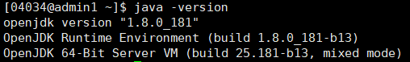

同时，在 04034 的环境中还安装了 Java 开发工具 version 17 版本，可通过 `jenv` 切换。

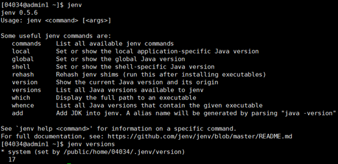

___

## 文档更新日志
V1.3 (2025-04-07)：
1）更新联网命令
2）增加 spack 包管理器介绍；
3）增加 jenv JDK 管理器的介绍

V1.2 (2022-05-08)：
1）增添注意事项
2）更新 Linux 学习内容；
3）新增 R 学习内容；
4）修复 PDF 复制命令行时格式错误的问题；
5）新增 Module 工具介绍。
